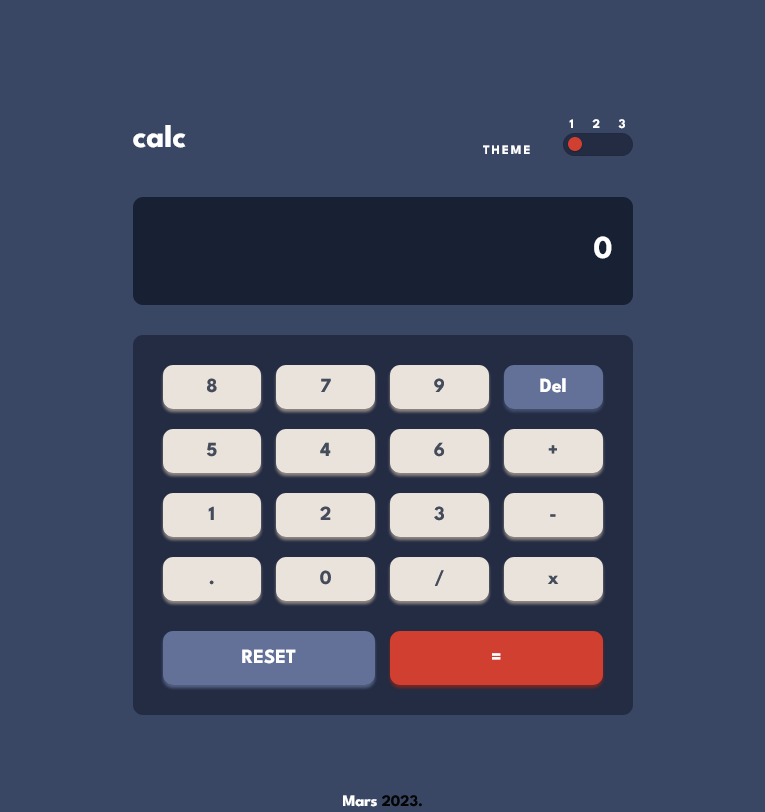

# Calculator app

This is a solution to the [Calculator app challenge on Frontend Mentor](https://www.frontendmentor.io/challenges/calculator-app-9lteq5N29).

## Table of contents

- [Overview](#overview)
  - [The challenge](#the-challenge)
  - [Screenshot](#screenshot)
  - [Links](#links)
- [My process](#my-process)
  - [Built with](#built-with)
  - [What I learned](#what-i-learned)
  - [Useful resources](#useful-resources)
- [Author](#author)
- [Acknowledgments](#acknowledgments)

## Overview

### The challenge

Users should be able to:

- See the size of the elements adjust based on their device's screen size
- Perform mathmatical operations like addition, subtraction, multiplication, and division
- Adjust the color theme based on their preference
- **Bonus**: Have their initial theme preference checked using `prefers-color-scheme` and have any additional changes saved in the browser

### Screenshot



### Links

[Solution](https://marsade.github.io/calculator-app/)

[Live Site](https://marsade.github.io/calculator-app/)

## My process

### Built with

- Semantic HTML5 markup
- CSS custom properties
- Flexbox
- CSS Grid
- SCSS
- [JQuery](https://jquery.com/)

### What I learned

I learned about `localStorage` on this project. I also learned more about jQuery and JavaScript functionality.

-Proud of these snippets:

```css
.theme-toggle {
	display: flex;
	justify-content: space-evenly;
	align-items: flex-end;
}
.theme-toggle p {
	padding-right: 30px;
	font-size: 13px;
	letter-spacing: 2px;
	margin-bottom: 3px;
}
```

```js
let endValue = "";
$("input").click(function () {
	let input = $(this).attr("value");

	// change x to *
	if (input === "x") {
		endValue += "*";
	} else if (input === "Del") {
		endValue = endValue;
	} else {
		endValue += input;
	}
	result.text(endValue);
	console.log(endValue);
});
```

### Useful resources

- [Jtoggler Plugin JQuery](https://www.jqueryscript.net/form/three-states-switch-jtoggler.html) - This helped me to implement the toggle button.
- [Localstorage Docs](https://developer.mozilla.org/en-US/docs/Web/API/Window/localStorage) - This is the Mozilla localstorage Docs which I found really helpful.

## Author

- Frontend Mentor - [@marsade](https://www.frontendmentor.io/profile/marsade)
- Twitter - [@marsthegr8](https://www.twitter.com/marsthegr8)

## Acknowledgments

I de code! I also acknowledge my resilience
